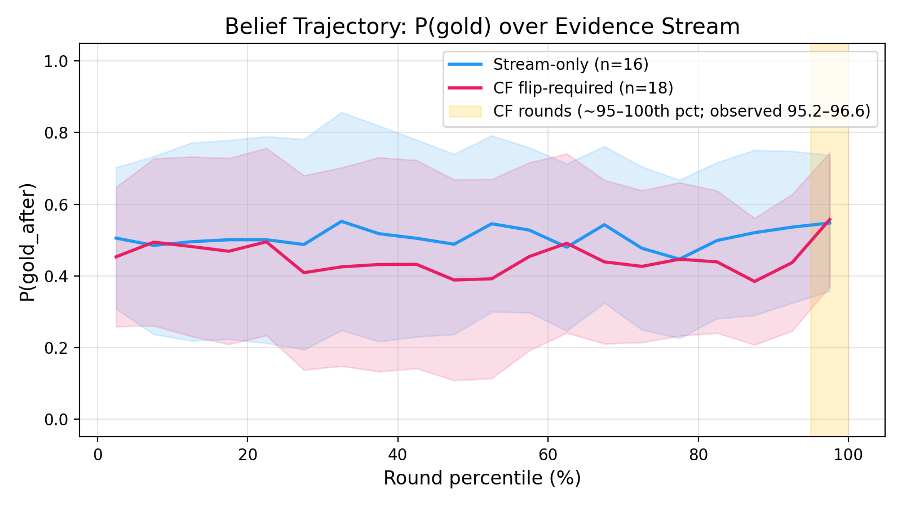
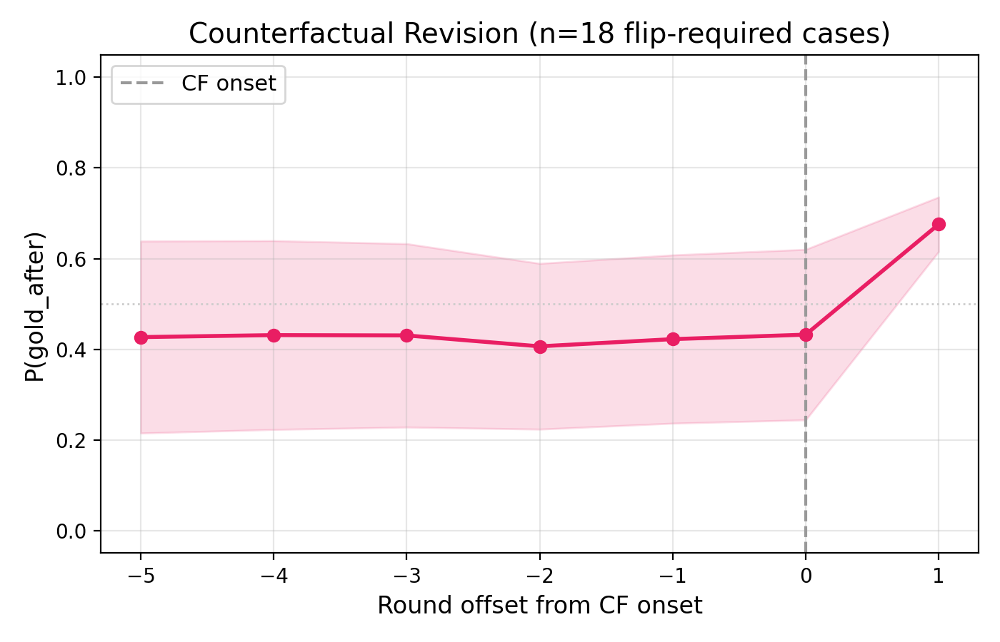
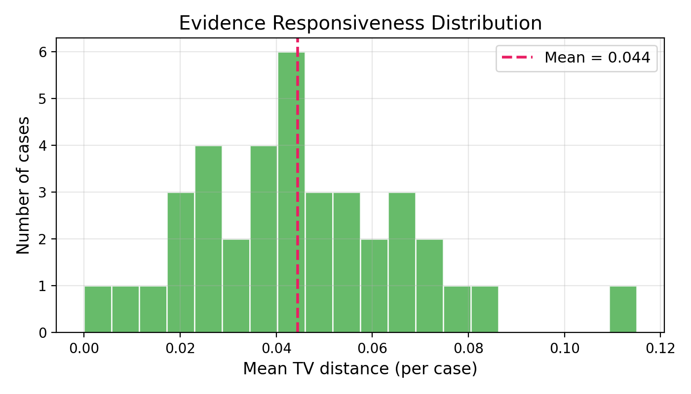

<!-- _class: title -->

# MuSR-Stress
## Stress-Testing LLMs on Long-Context and Revisable Belief Reasoning

James Cheng · CS 422

<!--
Hi everyone, I'm James. Today I'll be presenting MuSR-Stress — a benchmark that stress-tests how well LLMs update their beliefs when evidence arrives piece by piece, rather than all at once.
-->

---

## Motivation & Background

- LLMs do well on **static QA** — but real reasoning requires updating beliefs as evidence evolves
- **MuSR** (Sprague et al., 2024) synthetically generates logic-tree-grounded QA across murder mystery, object placement, and team allocation
- **MuSR-Stress** extends the murder mystery domain to trajectory-level belief tracking across 2 tracks:

| Track | Tests |
|---|---|
| `long_context` | Attention over long narratives with distractors |
| `dynamic_belief` | Belief updates + counterfactual revision |

Each track: **250 cases · 175 train / 37 dev / 38 test**

<!--
The key insight here is that most benchmarks test LLMs on static snapshots — you give the model all the info and ask for an answer. But real-world reasoning is incremental: detectives get new clues, doctors get new test results, analysts get new data. We want to test whether models can actually revise their beliefs as new evidence comes in.

MuSR by Sprague et al. already had a nice setup: synthetically generated murder mysteries grounded in logic trees. We extend it with two tracks — long_context pads in distractor cases to test attention, and dynamic_belief streams evidence round-by-round and optionally injects a counterfactual correction to see if the model can change its mind.
-->

---

## Base Story Generation Pipeline

```
 Madlib pools          Logic Tree              Narrative            QA Instance
(no LLM)              (LLM fills values)      (LLM writes)
─────────────         ──────────────────      ────────────         ───────────
names                 "Suspect is killer"     "Detective            question
weapons         ───►  ├─ has means      ───►  Winston              choices
crime scenes          │  ├─ [fact]            observed..."    ───►  gold answer
motives               │  └─ [commonsense]                          logic trees
                      ├─ has motive
                      └─ has opportunity
```

**Validators gate the logic tree step** — wrong structure or forbidden keywords → retry

<!--
This is the original MuSR pipeline — I didn't build this part, Sprague et al. did. The important thing to understand is that each murder mystery is grounded in a logic tree. Madlib pools randomly sample names, weapons, crime scenes — no LLM needed. Then an LLM fills in the logic tree values: "this suspect has means because they had access to the weapon," etc. Another LLM call writes the narrative. Validators check the logic tree structure and retry if it's malformed.

The key property this gives us is that every story has a formally verifiable gold answer — it's not just "whatever sounds right," it's backed by the logic tree.
-->

---

## Dynamic Belief Track

```
base case
  │  rounds 1–N:  narrative paragraphs (no round cap)
  │                13–43 rounds/case · median 25 · each round = one scene beat
  │
  └─► 170/250 cases (68%): counterfactual correction appended after final paragraph
          ├── flip_required=True  (120/170 CF, ~71%): gold answer changes → model must revise
          └── flip_required=False  (50/170 CF, ~29%): gold unchanged     → model must stay stable
```

Config: `counterfactual_rate=0.7` (70% of cases get CF block) · `flip_rate=0.7` (of those, 70% require gold to change) · `seed=7` (reproducibility)

<!--
This is the core of what I built. We take each base case and split the narrative into paragraph-level rounds — each round is one scene beat. Cases range from 13 to 43 rounds with a median of 25.

Then for 70% of cases, we append a counterfactual correction block at the end. This block says something like "actually, the witness testimony against suspect A was wrong" and introduces new evidence pointing to suspect B. In 71% of those CF cases, the gold answer actually changes — the model needs to flip its belief. In the remaining 29%, the correction doesn't change the answer — the model should stay stable.

This lets us test two things: can the model revise when it should, and can it resist spurious revision when it shouldn't?
-->

---

## Evaluation Protocol

Evidence streamed round-by-round; model re-prompted at each round.

| Metric | What it captures |
|---|---|
| `final_accuracy` / `brier_final` | Correctness and calibration |
| `flip_when_required` / `stability_when_not_required` | CF revision success / spurious flip rate |
| `belief_trajectory` | P(gold) curve over rounds — how beliefs evolve |
| `evidence_responsiveness` | Mean distributional shift between rounds (TV distance) |

<!--
Speaker notes — metric formulas:

- final_accuracy: 1 if argmax P(suspect) == gold at last round, else 0. Averaged over cases.
- brier_final: sum over suspects of (p_i - y_i)^2 at the final round, where y_i=1 for gold, 0 otherwise.
- flip_when_required: for CF + flip_required cases, 1 if model's top suspect after CF == gold_after. Averaged over applicable cases.
- stability_when_not_required: for CF + NOT flip_required cases, 1 if top suspect before CF == top suspect after CF. Averaged.
- evidence_responsiveness: mean total-variation distance between consecutive rounds' probability distributions. TV = 0.5 * sum |p_i(t) - p_i(t-1)|. Only narrative rounds (excludes CF rounds). Averaged per case, then across cases.

The key idea is that we're not just asking "did you get the right answer?" — we're watching *how* the model's beliefs evolve over time. We prompt the model at every single round and ask it to output a probability distribution over suspects. This gives us a full belief trajectory, not just a final answer.
-->

---

## Example: Counterfactual Case

**Suspects:** Dale vs. Letti · Gold flips after final narrative round (`flip_required=True`)

| Rounds | Type | Evidence |
|---|---|---|
| 1–37 | narrative | Full story evidence stream |
| **38** | **CF** | **Correction: key witness timestamp used against Letti was wrong and withdrawn** |
| **39** | **CF** | **Dale phone/location + weapon purchase + escalating conflict records** |

CF block appended as final 2 rounds — tests whether model can override accumulated belief.

<!--
Here's a concrete example. We have a case with suspects Dale and Letti. For 37 rounds, the model sees the full story evidence stream — narrative paragraphs building up the case. Then round 38 drops a correction: a key witness timestamp used against Letti was actually wrong and gets withdrawn. Round 39 introduces new evidence — Dale's phone location, a weapon purchase, escalating conflict records.

The gold answer flips from Letti to Dale. The question is: after 37 rounds of building up belief, can the model actually change its mind in just 2 rounds?
-->

---

## Results (Qwen2.5-7B, cs422_v3 test, n=38)

| Metric | Value |
|---|---|
| `final_accuracy` | 0.816 |
| — CF (n=22) | 0.955 |
| — stream-only (n=16) | 0.625 |
| `brier_final` | 0.356 |
| `flip_when_required` (n=18) | 1.000 |
| `stability_when_not_required` | 0.750 |
| `evidence_responsiveness` | **0.041** |

**Key takeaways:**
- **Near-zero responsiveness** (0.041) — the model barely shifts beliefs round-to-round, despite new evidence each time
- **Stream-only accuracy trails CF by 33 points** (0.625 vs 0.955) — without a corrective nudge, the model locks in early and rarely recovers

<!--
Two big stories here. First, evidence responsiveness is 0.041 — on a scale where 0 means "completely ignoring new evidence" and 1 means "completely changing your mind every round." The model outputs nearly the same probability distribution round after round. It's barely reacting to new information.

Second, look at the split between CF and stream-only cases. CF cases get 95.5% accuracy — but that's partly because the counterfactual block is a very explicit "hey, change your mind" signal. Stream-only cases, where the model has to track evidence on its own without that nudge, drop to 62.5%. That's a 33-point gap, suggesting the model locks in early and doesn't self-correct.

One caveat on flip_when_required: 6 of the 18 cases were non-diagnostic — the model was already on gold_after before the CF block, so it didn't actually need to flip. On the 12 truly diagnostic cases, Qwen still flips correctly in all of them, which is encouraging.
-->

---

## Belief Trajectory: P(gold) over Evidence Stream
<!-- _class: plot -->

- Trajectory CF line uses only `flip_required` cases.
- Yellow band marks where CF rounds occur (`~95th–100th` percentile).
- Read this plot as end-of-stream separation; use the aligned view below for jump sharpness.

**Qwen2.5-7B**


<!--
This plot shows P(gold) — the model's probability assigned to the correct answer — over the evidence stream, normalized to percentile so cases with different round counts are comparable.

The yellow band on the right marks where CF rounds occur. You can see that stream-only cases (no correction) tend to plateau — the model either gets it right early or doesn't recover. CF cases show a visible jump in the yellow band as the model responds to the correction.

The main takeaway: beliefs are relatively flat throughout the narrative, then spike at the CF block. The model isn't gradually building confidence — it's mostly static until explicitly told to change.
-->

---

## CF Revision (Aligned to CF Onset)
<!-- _class: plot -->

- This alignment makes the post-CF belief shift directly visible.

**Qwen2.5-7B**


<!--
This is the same data but aligned to the CF onset point — round 0 here is when the counterfactual block starts. This makes the jump much more visible. You can see that before the CF block, P(gold_after) is low — the model was tracking gold_before. Then right at the CF block, there's a sharp jump upward. This confirms that the model can revise when given an explicit correction, but the sharpness of the jump also shows it happens all at once rather than gradually.
-->

---

## Evidence Responsiveness Distribution
<!-- _class: plot -->

**Qwen2.5-7B**


<!--
This histogram shows the distribution of evidence responsiveness across cases. Most cases cluster near zero — the model's probability distribution barely changes between consecutive rounds. A few cases show higher responsiveness, but the vast majority are under 0.1. This tells us the model is essentially outputting the same belief distribution round after round, regardless of what new evidence it sees. It's treating each round as confirmation of its existing belief rather than as new information to integrate.
-->

---

## Next Steps & Conclusion

**Conclusion**
- Streaming eval **exposes reasoning dynamics invisible to static benchmarks** — a model can score 82% overall, but its belief updates are bursty and undirected rather than driven by incremental evidence
- Models do change beliefs, but in bursty, undirected jumps — switching helps about as often as it hurts (5 vs 3 in stream-only)
- Low responsiveness (~0.04) reflects mostly-frozen rounds with bursty shifts — but many rounds lack new evidence, so this metric needs refinement

**Next steps**
- Integrate counterfactual changes into base story generation (not post-processing)
- Stronger prompting: CoT belief tracking, symbolic evidence graph
- Scale to larger models and add human baseline

<!--
To wrap up — the big picture finding is that streaming eval reveals things static benchmarks can't. A model can get 82% final accuracy, which looks decent, but when you look at the trajectory you see it's barely updating beliefs round-to-round. It locks in early and rides that initial guess.

The most important next step is integrating counterfactual changes into the base story generation itself, rather than post-processing. Right now the narrative doesn't always strongly support gold_before, which makes some CF cases non-diagnostic. If we bake the counterfactual into the story generation, we can ensure the narrative genuinely supports the original answer before flipping it.

Happy to take questions!
-->

---

<!-- _class: title -->

# Thank You!

James Cheng · CS 422
