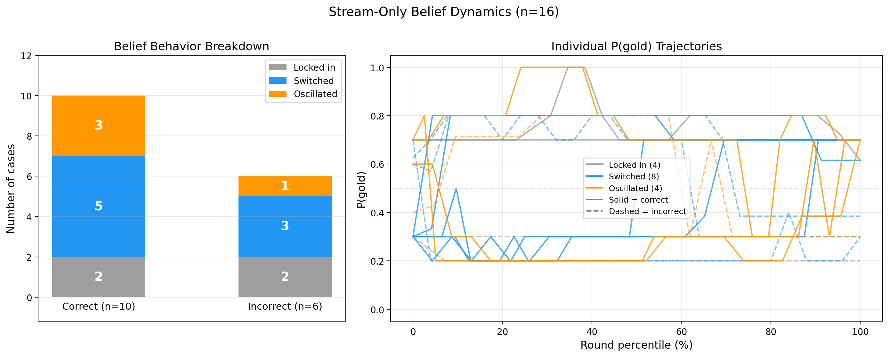

<!-- _class: title -->

# MuSR-Stress
## Stress-Testing LLMs on Long-Context and Revisable Belief Reasoning

James Cheng · CS 422

<!--
Hi everyone, I'm James. Today I'll be presenting MuSR-Stress — a benchmark that stress-tests how well LLMs update their beliefs when evidence arrives piece by piece, rather than all at once.
-->

---

## Motivation & Background

- LLMs do well on **static QA** — but real reasoning requires updating beliefs as evidence evolves
- **MuSR** (Sprague et al., 2024) synthetically generates logic-tree-grounded murder mysteries — every story has a formally verifiable gold answer
- **MuSR-Stress** extends this to trajectory-level belief tracking across 2 tracks:

| Track | Tests |
|---|---|
| `long_context` | Attention over long narratives with distractors |
| `dynamic_belief` | Belief updates + counterfactual revision |

Each track: **250 cases · 175 train / 37 dev / 38 test**

<!--
Most benchmarks give the model all the info at once and ask for an answer. But real-world reasoning is incremental — detectives get new clues, doctors get new test results. We want to test whether models can actually revise their beliefs as new evidence comes in.

MuSR by Sprague et al. generates murder mysteries grounded in logic trees — madlib pools sample names and weapons, an LLM fills in the logic tree, another writes the narrative. The key property: every story has a formally verifiable gold answer backed by the tree. I extend this with two tracks — today I'll focus on dynamic_belief, which streams evidence round-by-round and optionally injects a counterfactual correction.
-->

---

## Dynamic Belief Track

```
base case
  │  rounds 1–N:  narrative paragraphs (no round cap)
  │                13–43 rounds/case · median 25 · each round = one scene beat
  │
  └─► 170/250 cases (68%): counterfactual correction appended after final paragraph
          ├── flip_required=True  (120/170 CF, ~71%): gold answer changes → model must revise
          └── flip_required=False  (50/170 CF, ~29%): gold unchanged     → model must stay stable
```

At each round, model outputs a **probability distribution over suspects** — giving us a full belief trajectory.

<!--
This is the core of what I built. We take each base case and split the narrative into paragraph-level rounds — each round is one scene beat.

For 70% of cases, we append a counterfactual correction block at the end — something like "actually, the witness testimony against suspect A was wrong" plus new evidence pointing to suspect B. In 71% of those, the gold answer changes and the model needs to flip. In the rest, the answer stays the same and the model should hold steady.

Crucially, we prompt the model at every single round and ask for a probability distribution over suspects. So we don't just get a final answer — we get a full trajectory of how beliefs evolve. Key metrics: final accuracy, Brier score for calibration, flip_when_required for CF revision, and evidence responsiveness — the mean total-variation distance between consecutive rounds.
-->

---

## Results (Qwen2.5-7B, cs422_v3 test, n=38)

| Metric | Value |
|---|---|
| `final_accuracy` | 0.816 |
| — CF (n=22) | 0.955 |
| — stream-only (n=16) | 0.625 |
| `brier_final` | 0.356 |
| `flip_when_required` (n=18) | 1.000 |
| `stability_when_not_required` | 0.750 |
| `evidence_responsiveness` | **0.041** |

**Key takeaways:**
- **Low responsiveness** (0.041) — but not all paragraphs carry new evidence; many are dialogue or scene-setting, so low TV may partly reflect appropriate stability
- **Stream-only accuracy trails CF by 33 points** (0.625 vs 0.955) — the model benefits heavily from an explicit correction signal

<!--
Two stories here. First, evidence responsiveness is 0.041 — that's low, but there's an important caveat: not every paragraph contains decision-relevant evidence. Many rounds are dialogue, scene-setting, or narrative transitions with no new forensic clues. So the model staying frozen on those rounds might actually be reasonable. The metric conflates "model ignores evidence" with "no meaningful evidence was presented." A future improvement would be to label which rounds carry genuine new evidence and measure responsiveness only on those.

Second, CF cases get 95.5% accuracy, but stream-only drops to 62.5%. That 33-point gap suggests the model benefits heavily from an explicit correction signal.

One caveat on flip_when_required: 6 of 18 cases were non-diagnostic — the model was already on the post-CF gold answer before the correction. On the 12 truly diagnostic cases, Qwen still flips correctly in all of them.
-->

---

## Stream-Only Belief Dynamics (n=16)
<!-- _class: plot -->

- Three behaviors: **locked in** (never switches), **switched** (ends on different suspect), **oscillated** (switches but returns)
- Only 4/16 truly lock in — most cases show belief changes, but changes aren't reliably evidence-driven



<!--
We categorized all 16 stream-only cases into three behaviors. "Locked in" means the top suspect never changed — only 4 cases do this, 2 correct and 2 incorrect. "Switched" means the model ended on a different suspect than it started — 8 cases, split 5 correct and 3 incorrect. "Oscillated" means the model switched suspects mid-stream but came back to the original — 4 cases, 3 correct and 1 incorrect.

The key takeaway: the model is not static — it does change its beliefs. But the changes aren't reliably driven by evidence. Switching helps about as often as it hurts (5 vs 3). And the oscillation cases are interesting — the model bounces back and forth, suggesting instability rather than systematic evidence integration. This is consistent with the low but nonzero evidence responsiveness: beliefs change in bursty jumps on a few rounds, while most rounds show zero change.
-->

---

## CF Revision (Aligned to CF Onset)
<!-- _class: plot -->

- X-axis: rounds relative to CF onset (round 0 = first CF round)
- Sharp jump in P(gold_after) at the correction point

**Qwen2.5-7B**


<!--
This is the most telling plot. The x-axis is aligned so round 0 is when the counterfactual block starts. Before the CF block, P(gold_after) is low — the model was tracking the original gold answer. Then right at the CF block, there's a sharp jump upward.

This confirms two things: the model can revise when given an explicit correction, but the sharpness shows it happens all at once — not gradually. During the narrative portion, beliefs do shift, but the changes are small and gradual compared to the sharp jump at the CF block.
-->

---

## Conclusion & Next Steps

**Conclusion**
- Streaming eval **exposes reasoning dynamics invisible to static benchmarks** — a model can score 82% overall, but its belief updates are bursty and undirected rather than driven by incremental evidence
- Models do change beliefs, but in bursty, undirected jumps — switching helps about as often as it hurts (5 vs 3 in stream-only)
- Low responsiveness (~0.04) reflects mostly-frozen rounds with bursty shifts — but many rounds lack new evidence, so this metric needs refinement

**Next steps**
- Integrate counterfactual changes into base story generation (not post-processing)
- Scale to larger models and add human baseline

<!--
The big takeaway: streaming eval reveals things static benchmarks can't. 82% final accuracy looks decent, but the trajectory shows a bursty pattern — the model stays frozen most rounds, then abruptly shifts on a few. And when it does switch, it's not clearly driven by evidence — it switches toward and away from the correct answer at similar rates. Only 4 of 16 stream-only cases truly lock in; the rest show belief changes, but they look more like instability than reasoning.

The most important next step is integrating counterfactual changes into the story generation itself — right now the narrative doesn't always strongly support the original answer, making some CF cases non-diagnostic.

Happy to take questions!
-->

---

<!-- _class: title -->

# Thank You!

James Cheng · CS 422

---

## Backup: P(gold) over Evidence Stream
<!-- _class: plot -->

- CF line uses only `flip_required` cases; yellow band marks CF rounds (~95th–100th percentile).

**Qwen2.5-7B**


<!--
Backup slide in case someone asks about the aggregate trajectory. Shows P(gold) over round percentile — stream-only cases plateau while CF cases jump in the yellow band. Beliefs are flat until explicitly corrected.
-->
